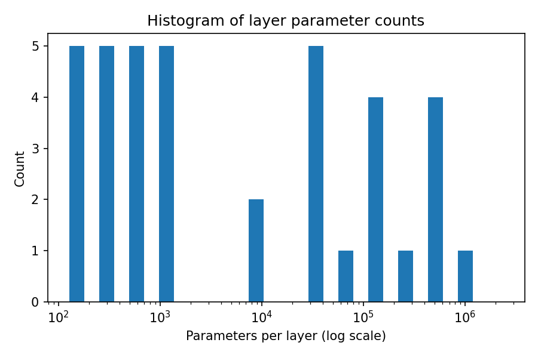
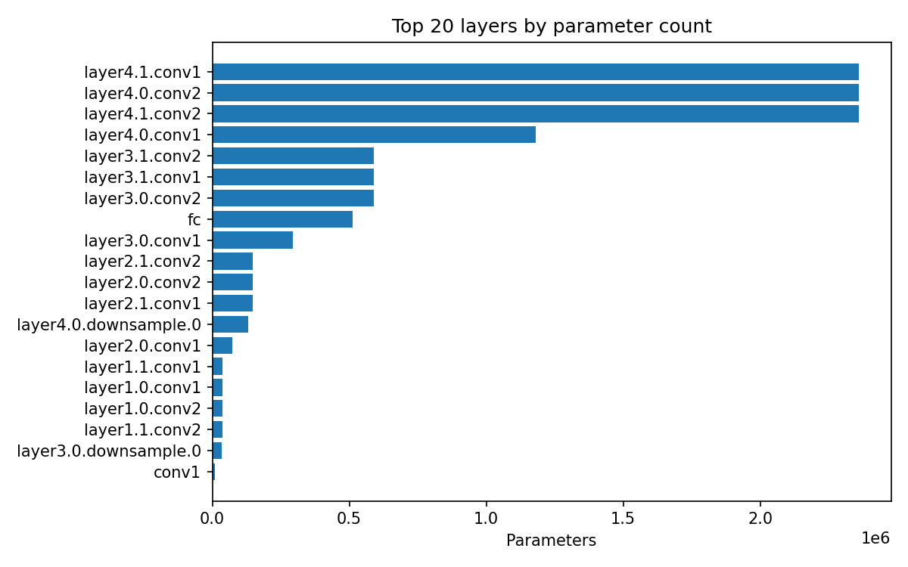
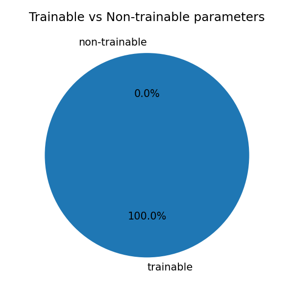
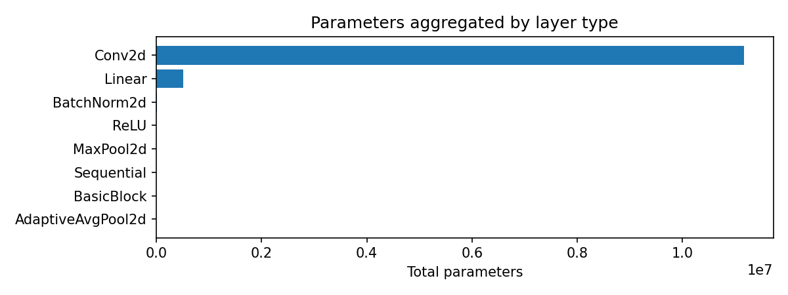

# تقرير نموذج — Model Report

## ملخص سريع

- **اسم النموذج:** ResNet
- **إجمالي البراميترات:** 11,689,512
- **براميترات قابلة للتدريب:** 11,689,512
- **عدد الطبقات الفرعية:** 67
- **شكل الإدخال:** (1, 3, 224, 224)
- **شكل الإخراج:** (1, 1000)
- **الجهاز:** cpu
- **النوع (dtype):** torch.float32

## أمثلة على طبقات مفصّلة

- `conv1`: Conv2d — params=9408 — trainable=9408 — output_shape=(1,64,112,112)
- `layer1.0.conv1`: Conv2d — params=36864 — trainable=36864 — output_shape=(1,64,56,56)
- `fc`: Linear — params=513000 — trainable=513000 — output_shape=(1,1000)

## ملفات تم إنشاؤها

- ملخص JSON: [model_demo_info.json](model_demo_info.json)
- صورة الهيرارشية (fallback networkx): [model_graph_networkx.png](model_graph_networkx.png)

## تحليل البراميترات والطبقات

- **إجمالي البراميترات:** 11,689,512  
- **البراميترات القابلة للتدريب:** 11,689,512  
- **أهم 5 طبقات حسب حجم البراميترات:** `layer4.1.conv1`, `layer4.0.conv2`, `layer4.1.conv2`, `layer4.0.conv1`, `layer3.1.conv2`

### الرسوم البيانية
  
  
  


## ملاحظات

- حاولت توليد رسم DOT عبر `torchviz`/Graphviz لكن ظهرت أخطاء تركيبية عند استدعاء `dot`، فاستعملت بديلًا باستخدام `networkx` + `matplotlib` لحفظ صورة مبسطة لهيرارشية الوحدات.
- إذا رغبت بإعادة المحاولة على SVG عبر `torchviz`، يمكنني تنظيف تسميات العقد أو تصدير النموذج إلى ONNX ثم عرضه عبر Netron.

## أوامر للتشغيل محليًا

```bash
# تشغيل الملخص التجريبي (أنشأ model_demo_info.json سابقًا)
python model_inspector_demo.py

# فتح التقرير
# على نظام يدعم فتح الملفات:
start reports\model_report.md  # Windows
open reports/model_report.md    # macOS
xdg-open reports/model_report.md # Linux
```
